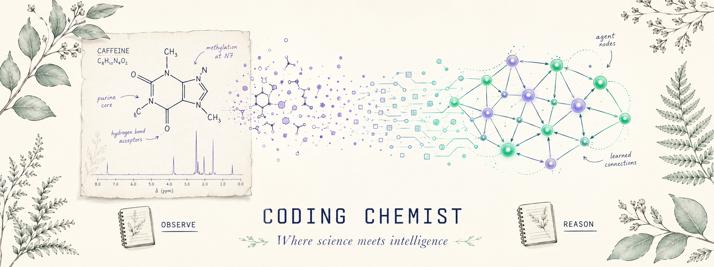

  

---

**Engineer at the intersection of Chemistry and AI. Lead in practice. Senior on paper.**

MSc Chemistry · MS Data Science · 6+ years shipping production AI.

---

Chemistry taught me to distrust confidence without evidence. AI is still learning that lesson — and some of us are building the lessons in.

Half my work is building AI that behaves like a chemistry experiment — *hypothesis, evidence, citation, peer review*. The other half is refusing to skip the careful parts when everyone else is in a hurry.

**Discipline isn't overhead. It's the work.**

---

## Lab

**01 — [Curie](https://github.com/coding-chemist/Curie)**
Citation-backed RAG pipeline for NMR structure elucidation. *Retrieves first, reasons second, shows its work.*

**02 — [Darwin](https://github.com/coding-chemist/Darwin)**
AI-augmented technical interview platform. *A 7-agent panel scores how candidates code with AI in the loop.*

**03 — [SmartHire](https://github.com/coding-chemist/SmartHire)**
LLM-powered resume screening with structured candidate comparisons and SWOT analysis.

**04 — [Explore-AI](https://github.com/coding-chemist/Explore-AI)**
A living notebook of AI topics. *Published as I learn them.*

---

## How I work

**Retrieve before you reason. Validate before you trust. Cite before you conclude.**

Not a slogan — discipline. Chemistry fails publicly when you cut corners. AI fails *confidently*. Both demand the same humility: build the audit trail first, then earn the right to a conclusion.

---

[LinkedIn ↗](https://www.linkedin.com/in/sindhujasivaraman/) · [Portfolio ↗](https://coding-chemist.vercel.app)

> *I know it's hard. But it's possible.*
